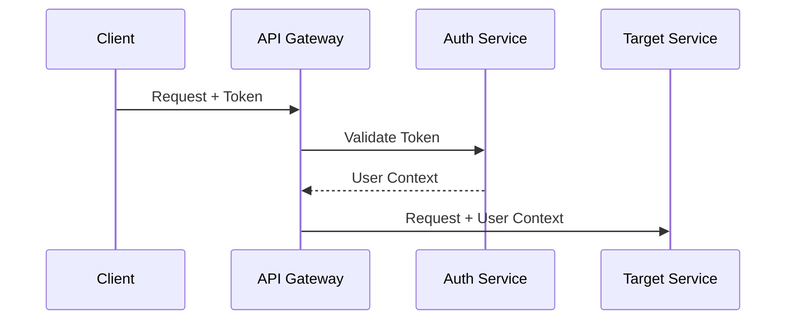

# Component Catalog Template

Use this template for documenting system components in Solution Architecture mode.

---

```markdown
# Component Catalog

## Overview

This catalog documents all components in [System Name]. Each component includes its responsibilities, interfaces, dependencies, and operational characteristics.

## Component Index

| Component | Type | Owner | Status |
|-----------|------|-------|--------|
| [API Gateway](#api-gateway) | Infrastructure | Platform Team | Active |
| [User Service](#user-service) | Application | User Team | Active |
| [Order Service](#order-service) | Application | Commerce Team | Active |

---

## API Gateway

### Overview

| Property | Value |
|----------|-------|
| **Type** | Infrastructure |
| **Owner** | Platform Team |
| **Repository** | `github.com/org/api-gateway` |
| **Runtime** | Kong / AWS API Gateway / Custom |
| **Status** | Active |

### Responsibilities

- Route incoming requests to appropriate services
- Handle authentication and authorization
- Rate limiting and throttling
- Request/response transformation
- SSL termination

### Interfaces

**Inbound:**
| Interface | Protocol | Port | Source |
|-----------|----------|------|--------|
| Public API | HTTPS | 443 | Internet |
| Internal API | HTTP | 8080 | VPC |

**Outbound:**
| Interface | Protocol | Target |
|-----------|----------|--------|
| User Service | HTTP | user-service.internal:8080 |
| Order Service | HTTP | order-service.internal:8080 |

### Dependencies

| Dependency | Type | Purpose |
|------------|------|---------|
| Redis | Cache | Session storage, rate limit counters |
| Auth Service | Service | Token validation |

### Configuration

| Variable | Description | Default |
|----------|-------------|---------|
| `RATE_LIMIT_PER_MINUTE` | Request limit per client | 100 |
| `AUTH_SERVICE_URL` | Auth service endpoint | - |

### Scaling

| Dimension | Configuration |
|-----------|---------------|
| Horizontal | Auto-scale 2-10 instances |
| Triggers | CPU > 70%, Request queue > 100 |

### Observability

| Metric | Alert Threshold |
|--------|-----------------|
| Request latency P99 | > 200ms |
| Error rate | > 1% |
| Active connections | > 1000 |

### Runbooks

- [High Latency Response](../ops/runbooks/api-gateway-latency.md)
- [Rate Limit Configuration](../ops/runbooks/api-gateway-rate-limits.md)

---

## User Service

### Overview

| Property | Value |
|----------|-------|
| **Type** | Application |
| **Owner** | User Team |
| **Repository** | `github.com/org/user-service` |
| **Runtime** | Node.js 18 |
| **Status** | Active |

### Responsibilities

- User registration and authentication
- Profile management
- Session management
- User preferences

### Data Ownership

| Entity | Description | Storage |
|--------|-------------|---------|
| User | Core user identity | PostgreSQL |
| UserProfile | Extended profile data | PostgreSQL |
| UserSession | Active sessions | Redis |

### API Endpoints

| Method | Path | Description |
|--------|------|-------------|
| POST | /users | Create user |
| GET | /users/:id | Get user |
| PUT | /users/:id | Update user |
| POST | /auth/login | Authenticate |
| POST | /auth/logout | End session |

### Events Published

| Event | Trigger | Consumers |
|-------|---------|-----------|
| `user.created` | New registration | Notification Service, Analytics |
| `user.updated` | Profile change | Search Index |
| `user.deleted` | Account deletion | All services |

### Events Consumed

| Event | Source | Action |
|-------|--------|--------|
| `subscription.changed` | Billing Service | Update user tier |

### Dependencies

| Dependency | Type | Purpose |
|------------|------|---------|
| PostgreSQL | Database | Primary data store |
| Redis | Cache | Sessions, caching |
| Email Service | External | Verification emails |

### Configuration

| Variable | Description | Required |
|----------|-------------|----------|
| `DATABASE_URL` | PostgreSQL connection | Yes |
| `REDIS_URL` | Redis connection | Yes |
| `JWT_SECRET` | Token signing key | Yes |

---

## [Next Component]

[Same structure...]

---

## Cross-Component Concerns

### Service Discovery

All services register with [Consul / K8s DNS / AWS Service Discovery].

| Service | DNS Name |
|---------|----------|
| User Service | user-service.internal |
| Order Service | order-service.internal |

### Authentication Flow



### Error Handling

All services implement standard error format:

```json
{
  "error": {
    "code": "ERROR_CODE",
    "message": "Human readable message",
    "correlationId": "uuid"
  }
}
```
```

---

## Catalog Maintenance

- Update when components change
- Review quarterly for accuracy
- Owner responsible for their component documentation
